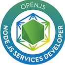

core interests:

- how to write code that is easy to understand
- self improvement
- having fun
- technological advancement
- practical philosophy
- mental models and metacognition

currently learning:
- systems design
- kotlin
- how to innovate

Fun fact: Some day in the far future, someone will have the very last memory of you for the very last time...

